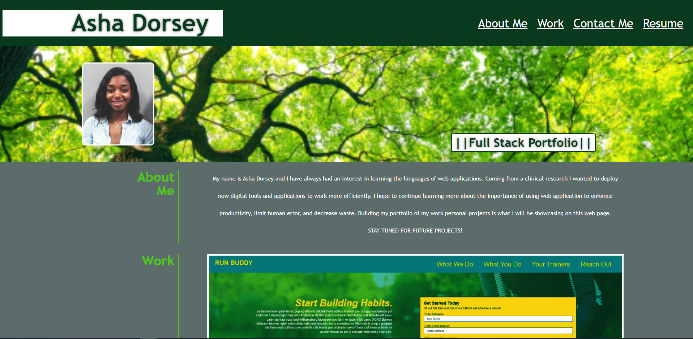

# :open_file_folder: Professional Portfolio: Advanced CSS Challenge :open_file_folder:

## Overview :book:
For this challenge I was assigned to showcase my portfolio, of several deployed web apps, in order to appeal to employers. This portfolio features my work as a fullstack developer.

### User Story :notebook_with_decorative_cover:
```
AS AN employer
I WANT to view a potential employee's deployed portfolio of work samples
SO THAT I can review samples of their work and assess whether they're a good candidate for an open position
```

### Client's Acceptance Criteria :pencil2:
```
GIVEN I need to sample a potential employee's previous work
WHEN I load their portfolio
THEN I am presented with the developer's name, a recent photo or avatar, and links to sections about them, their work, and how to contact them
WHEN I click one of the links in the navigation
THEN the UI scrolls to the corresponding section
WHEN I click on the link to the section about their work
THEN the UI scrolls to a section with titled images of the developer's applications
WHEN I am presented with the developer's first application
THEN that application's image should be larger in size than the others
WHEN I click on the images of the applications
THEN I am taken to that deployed application
WHEN I resize the page or view the site on various screens and devices
THEN I am presented with a responsive layout that adapts to my viewport
```

---
## Features

* Organized content
* Interactive links
* Deployed Web Applications
* Contact Info 
* Responsive web design (RWD)

---

## :link: Link to Webpage

Click the following link to visit the webpage:

[A live link to the webpage](https://adorsey5.github.io/watch-me-work/)


The following image is a screenshot of the webpage:



---
## :capital_abcd:Languages and Technology Used :computer:

### Languages
* HTML
* Advanced CSS (flexboxes, media queries)

### Technology

* VSCode
* GitBash
* Emojis from "Markdown Emoji" VSCode extension *

---

## Acknowledgments

For my second challenge I had a great deal of guidance from:

 * UM Coding Bootcamp Modules/GitLab Respository
 * UM Coding Bootcamp instructor and teacher assistants (TAs)
 * UM Coding Bootcamp Tutor: Jeremy Jones
 * UM Coding Bootcamp Classmates
 * Google

 ---
## Contribution
Made with ❤️ by Asha Dorsey
- - -
© 2021 Asha Dorsey
